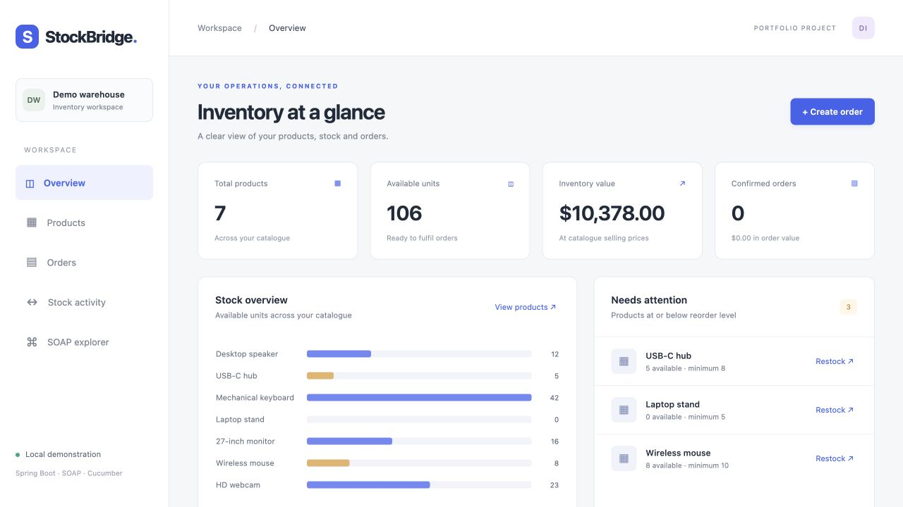

# StockBridge

**A working inventory and order management application built on the original Spring SOAP starter.**

Manage a product catalogue, reserve stock through multi-line orders, cancel orders safely, and inspect every stock movement. A browser dashboard and a contract-first SOAP service use the same transactional business logic.



## Start here

- **Preferred: work online without installing Mac software.** Follow [the browser-only Codespaces guide](docs/08-online-only.md). Java and builds run in the cloud. Verified in GitHub Codespaces with Java 17: all 19 tests passed.
- **New to coding?** Open [START-HERE.html](START-HERE.html) in your browser. The source files are already in their correct folders.
- **On this Mac:** double-click `START-STOCKBRIDGE.command`. Keep its Terminal window open. It opens [the dashboard](http://localhost:8080).
- **Run tests on this Mac:** double-click `RUN-TESTS.command`.
- **GitHub instructions:** [the beginner guide](docs/05-github-guide.md).
- **Demonstration:** [the demo script](docs/04-demo.md).

The Mac helpers prepare verified Java 17 and Maven downloads inside the ignored `.tools/` folder. They do not need Homebrew or a global Java installation. First use on a fresh computer needs internet access. The Mac route is optional; Codespaces needs no local software installation.

## Developer quick start

With Java 17 or later installed:

```sh
# macOS/Linux
./mvnw clean verify
./mvnw spring-boot:run
```

```powershell
# Windows PowerShell
.\mvnw.cmd clean verify
.\mvnw.cmd spring-boot:run
```

Dashboard: `http://localhost:8080` · SOAP endpoint: `http://localhost:8080/ws` · WSDL: `http://localhost:8080/ws/inventory.wsdl`

The application binds to loopback by default and stores its database in `data/stockbridge.mv.db`. Stop the app with Control+C. Restarting preserves products, orders and movement history. Tests use an isolated in-memory database and do not erase demo data.

## What is implemented

- Product creation with unique SKUs, decimal prices and reorder levels.
- Positive restocking with a movement history.
- Multi-line orders with exact decimal totals and atomic stock reservation.
- Product row locks to prevent competing orders from overselling.
- Idempotent cancellation: a repeated cancellation restores stock only once.
- Overview, searchable catalogue, order details, stock activity and SOAP explorer.
- Seven SOAP operations; generated Jakarta JAXB classes from the XSD; a published WSDL.
- Request schema validation, business faults and REST error responses.
- Cucumber scenarios over real SOAP HTTP requests, plus integration and concurrency tests.
- GitHub Actions build, test reports and application artifact.

## Project map

| Path | Purpose |
|---|---|
| `pom.xml` | Dependencies, Java version and code generation |
| `src/main/resources/xsd/inventory.xsd` | SOAP data contract: edit this to change message shapes |
| `src/main/java/com/example/springsoap/soap/` | SOAP operations and fault mapping |
| `src/main/java/com/example/springsoap/service/` | Validation, transactions and stock rules |
| `src/main/java/com/example/springsoap/repository/` | Database queries and row locks |
| `src/main/java/com/example/springsoap/web/` | JSON endpoints for the dashboard |
| `src/main/resources/static/` | Browser dashboard: HTML, CSS and JavaScript |
| `src/main/resources/schema.sql` | Database tables and constraints |
| `src/test/resources/features/` | Readable Cucumber business scenarios |
| `src/test/java/` | Executable integration tests and Cucumber steps |
| `examples/soap/` | Ready-to-send SOAP XML messages |
| `docs/` | Requirements, design, API, demo, GitHub and results |
| `target/generated-sources/jaxb/` | Generated classes; do not edit or commit |

## Documentation

1. [Analysis and acceptance criteria](docs/01-analysis.md)
2. [Architecture, database and sequence diagrams](docs/02-design.md)
3. [SOAP and REST interfaces](docs/03-api.md)
4. [Demonstration script](docs/04-demo.md)
5. [GitHub, step by step](docs/05-github-guide.md)
6. [Verified outcomes and limitations](docs/06-results.md)
7. [Roadmap and explanation notes](docs/07-roadmap-and-explanation.md)

## Scope and provenance

This is a local portfolio/learning application, with one demo warehouse and CAD prices. It has no authentication, payments, tax calculation, shipping or production deployment. Inventory value uses selling prices, not accounting cost. Confirmed order value is not recognised revenue. Order placement is not idempotent: re-sending a successful request can create another order.

The starter came from [zahir-imt/spring-soap-project](https://github.com/zahir-imt/spring-soap-project), whose history is preserved in this working copy. Its stated Spring Boot 3.x, contract generation and Cucumber direction is retained. The public demo WSDL in the starter README is replaced by a self-contained inventory contract so this demo and its tests do not depend on an outside service. This is an implementation choice, not a claim that Mr Zahir assigned this business domain. The original public demo service is not called by this version.

Implementation assistance: OpenAI Codex. Review and understand the included explanation notes before presenting the project.

References: [Spring SOAP documentation](https://docs.spring.io/spring-ws/docs/current/reference/html/), [Cucumber Java documentation](https://cucumber.io/docs/installation/java/).
