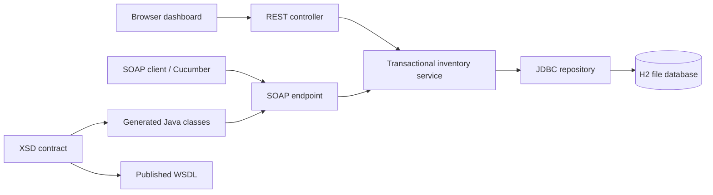
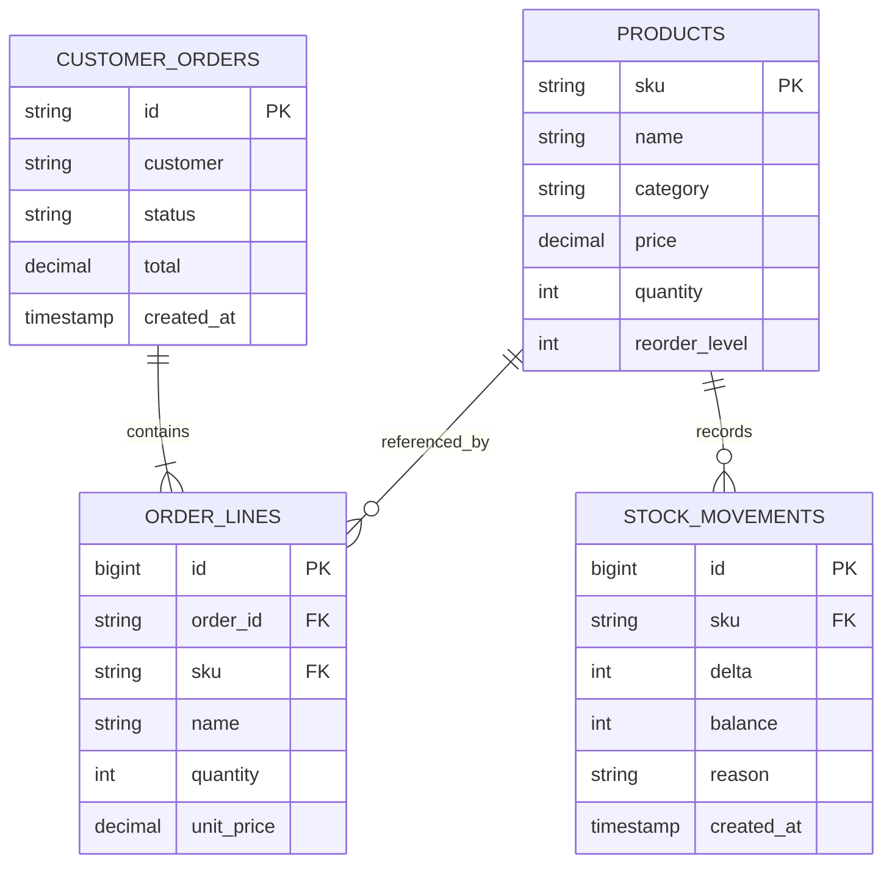

# 02 · Design

## Architecture



The dashboard calls REST. It does not secretly make SOAP calls for normal product and order actions. The SOAP explorer makes real XML HTTP calls. Both interfaces use the same service, which owns validation and transaction boundaries.

## Order sequence

```mermaid
sequenceDiagram
  participant C as Browser or SOAP client
  participant A as REST/SOAP adapter
  participant S as Inventory service
  participant D as Database
  C->>A: Place order
  A->>S: Customer and line items
  S->>S: Validate and sort SKUs
  S->>D: Begin transaction; lock product rows
  alt Every line has enough stock
    S->>D: Decrease quantities; record movements
    S->>D: Save order and price snapshots
    S->>D: Commit
    S-->>C: Confirmed order
  else Any line fails
    S->>D: Roll back entire transaction
    S-->>C: Business error / SOAP fault
  end
```

## Data model



Order lines snapshot the product name and unit price. Product stock is current availability. Movements record signed quantity changes and the resulting balance; the activity endpoint returns the latest 100 rows, while the database retains the full history.

## Key decisions

1. **Contract first:** XSD is the source for request and response Java classes; WSDL is generated by Spring-WS. This makes the SOAP interface inspectable independently of the Java implementation.
2. **Transactional service:** All mutations in an order or cancellation succeed together or roll back together.
3. **Pessimistic row locks:** `SELECT ... FOR UPDATE` serialises competing updates to a product. Multi-line orders lock sorted SKUs to avoid opposite lock ordering. Cancellation locks its order first, then products in SKU order.
4. **Exact money:** Java `BigDecimal` and SQL `DECIMAL` avoid binary floating-point arithmetic for persisted prices and totals. The browser's estimated total is only a preview; the server calculates the saved total.
5. **H2 file storage:** No separate database installation is needed. Tests use in-memory H2. PostgreSQL support is future work and has not been tested.
6. **Repeat-safe cancellation:** A locked `CANCELLED` order returns unchanged on subsequent cancellation. Order placement does not yet have request deduplication.
7. **Small frontend:** Plain HTML/CSS/JavaScript keeps setup simple. No Node build is required.

## Errors and consistency

REST uses JSON business codes with 400/404/409 statuses. SOAP business failures use a Client fault and a `code` detail. Schema failures are rejected before the service is invoked. Unexpected SOAP exceptions return a generic Server fault. Dashboard summaries are operational views, not transactionally consistent accounting reports; concurrent writes can occur between its separate reads.

## Production work still required

Authentication and authorisation, TLS at a hosting boundary, request idempotency for order creation, database migrations, a production database, structured monitoring, backups, pagination, load testing and deployment configuration. Version 1 binds only to the local machine.
